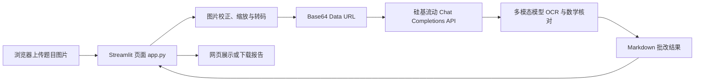
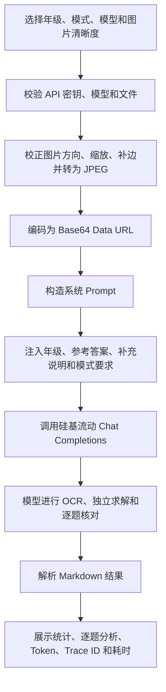

# 小学数学智能批改 Demo——完整项目文档

> 文档版本：1.0  
> 更新日期：2026-07-25  
> 项目目录：`D:\code\HomeWork`

## 1. 项目简介

本项目是一个基于 Streamlit 的小学数学试题图片批改 Demo。用户可以直接在网页中上传带有学生答案的题目照片，系统将图片发送给硅基流动提供的多模态大模型，完成题目识别、答案核对、错因分析和订正建议生成。

项目默认使用 `Qwen/Qwen3-VL-32B-Instruct`，页面同时提供多种主流多模态模型供用户切换，也支持手动填写自定义模型 ID。

### 1.1 核心功能

- 上传 JPG、JPEG、PNG、WEBP 题目图片。
- 一次处理最多 8 张图片。
- 选择小学一年级至六年级。
- 选择“快速批改”或“详细分析”。
- 从主流多模态模型列表中选择模型，或输入自定义模型 ID。
- 自动识别题干、学生答案、单位、图形和教师批注。
- 将每道题标记为“正确、错误、未作答、无法辨认”。
- 对错误题输出错误原因、正确答案、订正步骤和知识点。
- 输出本次作业的整体统计与学习建议。
- 显示处理阶段、进度、等待秒数和最终耗时。
- 显示输入/输出 Token 与 Trace ID。
- 下载 Markdown 格式的批改报告。
- 自动处理过窄的单行截图。

### 1.2 适用范围

当前提示词针对小学数学优化，适合口算、竖式计算、填空题、选择题、判断题、分数、小数、单位换算、应用题、基础几何题，以及带有手写答案的作业、练习册或试卷照片。

本项目不建议直接用于正式考试自动判分。重要结果应由教师或家长复核。

## 2. 系统架构



### 2.1 组件职责

| 组件 | 文件 | 主要职责 |
|---|---|---|
| 网页界面 | `app.py` | 文件上传、模型选择、进度展示、结果显示和报告下载 |
| 分析核心 | `exam_analyzer.py` | 图片预处理、提示词构造、API 请求、响应解析和错误转换 |
| 自动测试 | `tests/test_exam_analyzer.py` | 验证图片缩放、短截图兼容、提示词和 API 请求格式 |
| 环境安装 | `setup.ps1` | 创建虚拟环境并安装依赖 |
| 项目启动 | `run.ps1` | 使用项目虚拟环境启动 Streamlit |
| 服务配置 | `.streamlit/config.toml` | 限制本机访问、关闭遥测、设置上传上限 |
| 环境变量模板 | `.env.example` | API 地址、默认模型和密钥配置模板 |

## 3. 技术栈

| 技术 | 版本 | 用途 |
|---|---:|---|
| Python | 3.12 | 项目运行环境 |
| Streamlit | 1.49.1 | Web 页面 |
| Requests | 2.32.5 | 调用硅基流动 API |
| Pillow | 11.3.0 | 图片方向校正、缩放和格式转换 |
| python-dotenv | 1.1.1 | 读取 `.env` |
| pytest | 8.4.2 | 自动测试 |

硅基流动接口采用 OpenAI 兼容的 Chat Completions 格式：

```text
POST https://api.siliconflow.cn/v1/chat/completions
```

## 4. 项目目录

```text
D:\code\HomeWork
├── .env                         # 本机密钥，不应提交
├── .env.example                 # 环境变量模板
├── .gitignore                   # Git 忽略规则
├── .streamlit
│   └── config.toml              # Streamlit 服务配置
├── .venv                        # Python 虚拟环境
├── app.py                       # Web 页面入口
├── exam_analyzer.py             # 图片和 API 核心逻辑
├── PROJECT_DOCUMENTATION.md     # 本文档
├── README.md                    # 快速开始说明
├── requirements.txt             # Python 依赖
├── run.ps1                      # 启动脚本
├── setup.ps1                    # 环境安装脚本
└── tests
    └── test_exam_analyzer.py    # 自动测试
```

## 5. 环境准备

### 5.1 运行条件

- Windows 10/11 x64；
- Python 3.12；
- 可以访问 `api.siliconflow.cn`；
- 有效的硅基流动 API 密钥；
- 账户已满足平台实名认证、余额和模型权限要求。

### 5.2 一键安装

```powershell
cd D:\code\HomeWork
.\setup.ps1
```

如果系统阻止 PowerShell 脚本执行：

```powershell
powershell -ExecutionPolicy Bypass -File .\setup.ps1
```

安装脚本将检查虚拟环境、创建 `.venv`、更新 `pip`、安装依赖，并在缺少 `.env` 时从模板创建配置文件。

### 5.3 手动安装

```powershell
python -m venv .venv
.\.venv\Scripts\Activate.ps1
python -m pip install --upgrade pip
python -m pip install -r requirements.txt
```

## 6. 配置说明

### 6.1 API 密钥

```powershell
Copy-Item .env.example .env
```

编辑 `.env`：

```dotenv
SILICONFLOW_API_KEY=sk-请替换为你自己的密钥
SILICONFLOW_BASE_URL=https://api.siliconflow.cn/v1
SILICONFLOW_MODEL=Qwen/Qwen3-VL-32B-Instruct
SILICONFLOW_USE_SYSTEM_PROXY=false
```

| 环境变量 | 必填 | 默认值 | 说明 |
|---|---|---|---|
| `SILICONFLOW_API_KEY` | 是 | 无 | 硅基流动 API 密钥 |
| `SILICONFLOW_BASE_URL` | 否 | `https://api.siliconflow.cn/v1` | API 基础地址 |
| `SILICONFLOW_MODEL` | 否 | `Qwen/Qwen3-VL-32B-Instruct` | 页面默认模型 |
| `SILICONFLOW_USE_SYSTEM_PROXY` | 否 | `false` | 是否使用系统 `HTTP_PROXY/HTTPS_PROXY` |

真实密钥只能放在 `.env` 或安全的密钥管理系统中，不要写进源码、文档、截图或 Git 提交。

### 6.2 Streamlit 配置

`.streamlit/config.toml`：

```toml
[server]
address = "127.0.0.1"
headless = true
maxUploadSize = 120

[browser]
gatherUsageStats = false
```

服务只监听 `127.0.0.1`，默认不能被局域网其他设备访问，以防其他人通过页面消耗本机 API 额度。

## 7. 启动与停止

### 7.1 启动

```powershell
cd D:\code\HomeWork
.\run.ps1
```

浏览器访问：

```text
http://127.0.0.1:8501
```

手动启动：

```powershell
.\.venv\Scripts\python.exe -m streamlit run app.py
```

### 7.2 停止

在运行窗口按 `Ctrl + C`。后台运行时可先查询端口：

```powershell
Get-NetTCPConnection -State Listen -LocalPort 8501
```

确认进程 ID 后再停止对应进程。

## 8. 页面操作流程

1. 打开 `http://127.0.0.1:8501`。
2. 在侧边栏选择学生年级。
3. 选择“快速批改”或“详细分析”。
4. 选择多模态模型与图片清晰度。
5. 上传包含题目与学生答案的照片。
6. 如有需要，填写参考答案或补充说明。
7. 点击“开始批改”。
8. 等待进度条到达 100%。
9. 查看逐题结果，或下载 Markdown 报告。

参考答案不是必填项；不填写时模型会独立计算。补充说明可写：

```text
只批改红框内的题。
蓝色笔迹是学生答案，红色笔迹是教师批注。
第二张图片是第一张图片的参考答案。
```

## 9. 图片要求

### 9.1 硬性限制

| 项目 | 限制 |
|---|---|
| 文件格式 | JPG、JPEG、PNG、WEBP |
| 单张文件大小 | 不超过 15 MB |
| 一次上传数量 | 1～8 张 |
| 原始最小尺寸 | 宽和高均至少 8 px |
| 处理后最长边 | 1600、2000、2400、3000 或 3584 px |
| API 最小边 | 不足 56 px 时自动补白边 |

### 9.2 自动预处理

图片发送前会执行：

1. 校验文件是否为空和是否超过 15 MB；
2. 使用 EXIF 信息校正拍照方向；
3. 对短边不足 224 px 的长条截图进行等比放大；
4. 将最长边限制到页面选定尺寸；
5. 对仍不足 56 px 的短边补白色边缘；
6. 将透明背景合成为白色背景；
7. 转换为质量 94 的 JPEG；
8. 编码为 Base64 Data URL。

### 9.3 推荐尺寸

| 场景 | 推荐设置 |
|---|---|
| 单道口算或填空题 | 最长边 1600～2000 px |
| 数道题或普通练习册 | 最长边 2000～2400 px |
| 整页小字试卷 | 最长边 3000～3584 px |
| 横向单行截图 | 短边建议至少 150～300 px |

拍照时应保持纸面完整、光照均匀、镜头正对试卷，并避免阴影、反光、裁切和过度压缩。

## 10. 模型选择

模型是否可用、计费方式和上下线状态可能变化，应以硅基流动控制台当前列表为准。

| 页面名称 | 模型 ID | 推荐用途 |
|---|---|---|
| Qwen3-VL 8B Instruct | `Qwen/Qwen3-VL-8B-Instruct` | 日常单题、快速、低成本 |
| Qwen3-VL 30B A3B Instruct | `Qwen/Qwen3-VL-30B-A3B-Instruct` | 速度和效果平衡 |
| Qwen3-VL 32B Instruct | `Qwen/Qwen3-VL-32B-Instruct` | 默认选择、OCR 与数学较稳 |
| Qwen3-VL 32B Thinking | `Qwen/Qwen3-VL-32B-Thinking` | 复杂几何和多步推理，速度较慢 |
| Qwen3.5 9B | `Qwen/Qwen3.5-9B` | 新一代轻量多模态 |
| Qwen3.5 35B A3B | `Qwen/Qwen3.5-35B-A3B` | 新一代 MoE 多模态 |
| Qwen3.5 122B A10B | `Qwen/Qwen3.5-122B-A10B` | 大型 MoE，多步应用题、图表和复杂推理 |
| Qwen3.5 397B A17B | `Qwen/Qwen3.5-397B-A17B` | 旗舰超大 MoE，优先追求能力，耗时和费用最高 |
| Qwen3.6 27B | `Qwen/Qwen3.6-27B` | 新一代视觉理解和推理 |
| Qwen3.6 35B A3B | `Qwen/Qwen3.6-35B-A3B` | 新一代 MoE 多模态 |
| GLM-4.5V | `zai-org/GLM-4.5V` | 106B 视觉推理模型，适合复杂图文理解 |
| Kimi K2.6 Pro | `Pro/moonshotai/Kimi-K2.6` | 超大多模态模型，强推理，通常费用较高 |
| Qwen3 Omni 30B Instruct | `Qwen/Qwen3-Omni-30B-A3B-Instruct` | 图像、音频、视频综合输入 |
| DeepSeek OCR | `deepseek-ai/DeepSeek-OCR` | 文字提取，不推荐直接用于完整数学批改 |
| 自定义模型 | 用户输入 | 其他支持图片输入和 Chat Completions 的模型 |

### 10.1 选择建议

- 追求速度：`Qwen/Qwen3-VL-8B-Instruct`。
- 日常平衡：`Qwen/Qwen3-VL-30B-A3B-Instruct`。
- 更重视识别和讲解：`Qwen/Qwen3-VL-32B-Instruct`。
- 复杂图形和多步推理：Qwen3.5 122B、GLM-4.5V 或 Thinking 模型。
- 只追求最高能力且可接受更高费用与等待时间：Qwen3.5 397B。
- 只做 OCR：DeepSeek OCR；其输出不一定完整遵循报告格式。

截至 2026-07-25，项目通过硅基流动 `/v1/models` 接口确认上述新增模型 ID
对当前账户可见。旧的 `Qwen/Qwen3-VL-235B-A22B-Instruct` 和
`Qwen/Qwen3-VL-235B-A22B-Thinking` 已于 2026-04-22 下线，因此不加入列表。
大模型通常要求账户有可用付费余额；余额不足会直接返回 HTTP 402，并非模型超时。

项目真实冒烟测试中，8B 快速模型分析一张简单模拟错题约耗时 10.9 秒，并正确识别 `6×7=40` 为错误、给出正确答案 `42`。这只代表单次测试，实际速度受图片、题数、网络、账户限流和平台负载影响。

## 11. 快速批改与详细分析

| 模式 | 最大输出 Token | 输出特点 | 推荐场景 |
|---|---:|---|---|
| 快速批改 | 3000 | 判断依据简短，订正步骤最多 3 步 | 日常作业、单题或少量题目 |
| 详细分析 | 6000 | 更完整地说明核对过程 | 多题试卷、复杂应用题和几何题 |

两种模式共用相同的图片预处理、系统 Prompt、所选模型、高细节图片输入和采样参数。主要区别是用户 Prompt 中的输出约束和 `max_tokens` 上限。读取超时会根据模型规模动态设置，并且流式数据持续到达时会继续等待。

`max_tokens` 是允许生成的最大上限，不代表每次一定生成这么多 Token，也不代表调用开始时就按完整上限计费。

### 11.1 共用处理流程

无论选择哪种模式，系统都会执行：



共用的核心批改规则包括：

- 逐题识别题干、图形、单位和学生答案；
- 独立计算验证，不能只相信红勾、红叉或参考答案；
- 状态只能是“正确、错误、未作答、无法辨认”；
- 错误题必须给出正确答案、具体错因、订正步骤和知识点；
- 区分印刷内容、学生作答、草稿和教师批注；
- 使用简体中文，并避免输出冗长的内部思维过程。

### 11.2 快速批改流程

选择“快速批改”后，页面将 `is_fast` 设为 `True`，然后：

1. 图片仍按用户选择的清晰度处理，并以 `detail=high` 发送；
2. 调用 `analyze_exam(..., concise=True, max_tokens=3000)`；
3. 用户 Prompt 增加快速输出约束；
4. 模型仍需完成 OCR、独立求解和对错判断；
5. 每题只保留简短判断依据，错误题最多输出 3 个订正步骤；
6. 减少重复题干、背景解释和冗长学习建议；
7. 收到完整响应后一次性展示结果。

快速模式的实际附加 Prompt 为：

```text
当前为快速批改模式：判断依据控制在 1 句话，订正步骤最多 3 步，避免重复题干和冗长说明。
```

适合：单道错题、日常作业、只关心对错与正确答案、希望减少生成时间和输出费用的场景。

快速模式不会跳过 OCR、数学计算或答案核对，因此它是“精简输出”，不是“降低判题步骤”。模型服务排队和图片识别仍可能占用较长时间。

### 11.3 详细分析流程

选择“详细分析”后，页面将 `is_fast` 设为 `False`，然后：

1. 图片按相同流程处理，并以 `detail=high` 发送；
2. 调用 `analyze_exam(..., concise=False, max_tokens=6000)`；
3. 用户 Prompt 增加详细分析要求；
4. 模型完成 OCR、独立求解和逐题核对；
5. 更完整地说明判断依据、错误发生位置和关键计算过程；
6. 错误题可以给出更多订正步骤和针对性学习建议；
7. 收到完整响应后一次性展示结果。

详细模式的实际附加 Prompt 为：

```text
当前为详细分析模式：在保持清晰的前提下说明关键核对过程。
```

适合：应用题、几何题、分数题、多步骤计算、整页试卷，以及需要了解学生具体错误类型的场景。

### 11.4 两种模式的 Prompt 差异

| 项目 | 快速批改 | 详细分析 |
|---|---|---|
| 系统 Prompt | 相同 | 相同 |
| 图片输入 | `detail=high` | `detail=high` |
| 图片预处理 | 相同 | 相同 |
| 温度与 Top-P | `temperature=0.1`、`top_p=0.8` | 相同 |
| 最大输出 | 3000 Token | 6000 Token |
| `concise` 参数 | `True` | `False` |
| 判断依据 | 控制在 1 句话 | 可说明关键核对过程 |
| 订正步骤 | 最多 3 步 | 可按题目需要展开 |
| 重复题干 | 要求避免 | 允许为解释适度转述 |
| 对错判断标准 | 相同 | 相同 |
| OCR 和独立求解 | 都会执行 | 都会执行 |

用户 Prompt 的公共部分保持不变：

```text
请批改以上图片中的小学数学题。

学生年级：{grade}
用户提供的参考答案或教师说明：{reference}
其他说明：{context}
输出要求：{快速或详细模式对应的要求}
```

### 11.5 年级选择如何进入 Prompt

页面中的年级选项为一年级至六年级。选择结果不会改变图片本身，而是通过 `grade` 参数写入用户 Prompt。例如选择“四年级”时，模型会收到：

```text
学生年级：四年级
```

年级是提供给模型的教学上下文，不是程序中的固定答案库或硬编码课程规则。

### 11.6 年级选择会产生的影响

年级主要影响模型的讲解和教学判断：

| 影响项 | 具体表现 |
|---|---|
| 知识范围 | 优先使用该年级通常已经学习的概念、公式和运算方式 |
| 解题方法 | 尽量避免使用明显超出该年级的方程、负数、高阶代数或复杂公式 |
| 语言难度 | 低年级更口语化、步骤更直观；高年级可使用更完整的数学术语 |
| 错因分类 | 结合年级判断是口诀、进位退位、单位、分数意义、公式使用等错误 |
| 订正步骤 | 使用该年级更容易理解和模仿的方法 |
| 学习建议 | 推荐与该年级知识点相匹配的练习方向 |

一般情况下，同一道算术题的最终正确答案不会因为年级不同而改变；变化主要体现在解释方式和推荐方法。例如低年级可能使用连续加法、画图或实物分组，高年级可能直接使用乘法、分数性质或方程。

### 11.7 年级选择不会产生的影响

年级选择不会直接改变：

- 所选多模态模型；
- 图片清晰度、缩放和压缩方式；
- `detail=high` 图片参数；
- 最大图片数量和文件大小；
- 快速/详细模式的 Token 上限；
- API 地址、请求超时、温度和 Top-P；
- 图片中客观数字和正确答案。

### 11.8 年级选择错误时的后果

如果选择了错误年级，OCR 通常仍可识别文字，简单题的最终答案通常也不会改变，但可能出现：

- 讲解过于简单或过于高级；
- 使用学生尚未学习的方法；
- 知识点名称或学习建议与实际课程不匹配；
- 对开放题的评分标准和步骤要求不符合学生阶段；
- 图片上标注的年级与下拉框冲突，导致回答风格不一致。

因此应尽量选择学生真实年级。如果题目来自竞赛、跨年级练习或提前学习，可在“补充说明”中明确写出实际要求，例如：

```text
学生是四年级，但这是一道五年级提前学习题；请用四年级能理解的方法讲解。
```

年级只是一条提示信息，模型仍可能偶尔使用超纲方法。对教学方法有严格要求时，应在补充说明中明确限制，例如“不要使用方程”“请用画线段图的方法”。

## 12. 进度条机制

| 进度 | 含义 |
|---:|---|
| 0% | 检查上传文件 |
| 8% | 校正方向和尺寸 |
| 20% | 本地图片处理完成，开始调用模型 |
| 20%～92% | 流式调用阶段，百分比按时间估算 |
| 100% | 收到并解析完整结果 |

20%～92% 的数值仍是按照已等待时间计算的估算值，因为 API 不返回数学推理完成百分比；但阶段文字来自真实网络事件：

1. `正在创建 API 请求`：还没有本地请求 ID；
2. `正在连接硅基流动并提交图片`：已生成本地请求 ID，但还没有响应头；
3. `硅基流动已接收请求`：已取得 HTTP 响应头和服务端 Trace ID；
4. `已收到首个内容`：模型已开始流式生成答案；
5. `100%`：流式响应结束并成功解析完整结果。

因此，即使百分比是估算值，也能通过 ID 和阶段文字判断请求卡在本地、代理/网络、硅基流动网关还是模型生成阶段。

## 13. 数据处理流程

1. 浏览器将图片交给 Streamlit。
2. 应用在内存中读取文件。
3. Pillow 进行方向校正、缩放、补边和 JPEG 转换。
4. 图片转为 Base64 Data URL。
5. 系统提示词、用户提示词和图片组成 `messages`。
6. Requests 向硅基流动发送 HTTPS 请求。
7. 模型完成视觉识别和数学核对。
8. 应用解析 `choices[0].message.content`。
9. 页面显示 Markdown，并提供下载。

当前实现不会主动把上传图片保存到项目目录，但图片内容会发送给硅基流动 API 处理。

## 14. API 调用说明

### 14.1 请求地址

```http
POST https://api.siliconflow.cn/v1/chat/completions
Authorization: Bearer ${SILICONFLOW_API_KEY}
Content-Type: application/json
```

### 14.2 请求结构示例

以下示例省略了真实 Base64 内容：

```json
{
  "model": "Qwen/Qwen3-VL-32B-Instruct",
  "messages": [
    {
      "role": "system",
      "content": "你是一位严谨、耐心的小学数学老师……"
    },
    {
      "role": "user",
      "content": [
        {
          "type": "image_url",
          "image_url": {
            "url": "data:image/jpeg;base64,...",
            "detail": "high"
          }
        },
        {
          "type": "text",
          "text": "请批改以上图片中的小学数学题……"
        }
      ]
    }
  ],
  "stream": true,
  "max_tokens": 3000,
  "temperature": 0.1,
  "top_p": 0.8
}
```

### 14.3 超时与返回

Requests 使用 15 秒连接超时和按模型动态设置的“连续无数据读取超时”：

| 模型类型 | 连续无数据读取超时 |
|---|---:|
| 8B 等轻量模型 | 240 秒 |
| 30B A3B | 420 秒 |
| 27B/32B/35B | 600 秒 |
| Thinking 或 Pro | 900 秒 |

流式模式下，只要服务端持续发送数据，读取计时就会重置，因此总生成时间可以超过该值。只有连续指定时间没有收到任何新数据才会报读取超时。

应用逐行读取 SSE `data:` 事件并拼接 `choices[0].delta.content`。由于部分 SSE 响应头不声明字符集，程序先读取原始字节，再对每一行显式执行 UTF-8 解码，避免中文被按 ISO-8859-1 解码成 `æ…` 形式的乱码。同时记录本地请求 ID、响应头耗时、首内容耗时、总 API 耗时和响应头 `x-siliconcloud-trace-id`。Trace ID 可用于向硅基流动排查特定请求。

## 15. 批改提示词设计

系统提示词要求模型：

- 独立求解，不只依据红勾或红叉；
- 区分印刷题目、学生答案、草稿和教师批注；
- 对计算题核对运算过程；
- 对应用题核对列式、单位和答句；
- 对几何题核对图形条件；
- 看不清时输出“无法辨认”，不猜测；
- 对多道题逐题批改；
- 使用简体中文；
- 不输出冗长的内部推理过程。

模型输出被要求遵循：

```markdown
# 批改结论

# 逐题批改
## 第 1 题（状态：正确/错误/未作答/无法辨认）

# 学习建议
```

由于不同模型的指令遵循能力不同，最终 Markdown 格式可能存在轻微差异。

## 16. 为什么识别可能较慢

主要耗时来源：

1. 图片需要以 Base64 内容上传；
2. 高分辨率模式产生更多视觉 Token；
3. 32B 稠密模型会激活完整参数，计算量显著高于 8B 或 A3B MoE 模型；
4. 模型要完成 OCR、独立求解、答案核对和讲解；
5. 多图、多题会增加输入和输出；
6. 平台排队、冷启动、限流和网络质量会形成明显的长尾延迟；
7. 旧版使用非流式响应，必须等完整答案后才能知道服务端是否已接收请求。

提速建议：使用 8B 模型和“快速批改”；单题最长边使用 1600～2000；裁掉无关区域；避免重复页面；不需要时不要使用 Thinking 或 Pro 模型。

### 16.1 受控测试方法

本次测试统一使用：

- 一张 `2000×700` 的小学四年级应用题图片；
- 图片高细节模式 `detail=high`；
- 相同系统 Prompt 和详细分析 Prompt；
- 输入约 2017 Token；
- 同一 API 密钥和同一台电脑；
- 依次测试 8B、30B-A3B、32B；
- 比较系统代理、直连、非流式和流式。

### 16.2 实测结果

| 模型/方式 | 响应头 | 首内容 | 完整耗时 | 结果 |
|---|---:|---:|---:|---|
| Qwen3-VL 8B，详细模式 | 未单独记录 | 未单独记录 | 15.2 秒 | 成功，Trace ID 已返回 |
| Qwen3-VL 30B-A3B，详细模式 | 未单独记录 | 未单独记录 | 19.9 秒 | 成功，Trace ID 已返回 |
| Qwen3-VL 32B，旧版非流式、经过代理 | 完整结束时返回 | 完整结束时返回 | 63.6 秒 | 成功 |
| Qwen3-VL 32B，旧版非流式、绕过代理 | 完整结束时返回 | 完整结束时返回 | 66.1 秒 | 成功 |
| Qwen3-VL 32B，原始流式对照 | 3.8 秒 | 3.9 秒 | 25.8 秒 | 成功 |
| Qwen3-VL 32B，正式流式实现复测 | 2.8 秒 | 2.8 秒 | 72.7 秒 | 成功 |

32B 两次流式测试的完整耗时差异很大，说明平台负载、排队和单次生成存在明显长尾；但两次都能在约 3 秒取得响应头和首内容。流式改造不能保证模型总计算时间固定，却能尽早证明服务端已经收到请求，并通过持续数据避免旧版整段等待触发读取超时。

### 16.3 代理测试结论

本机存在：

```text
HTTP_PROXY=http://127.0.0.1:7897
HTTPS_PROXY=http://127.0.0.1:7897
```

受控测试结果：模型列表接口经过代理约 0.89 秒、直连约 1.27 秒；32B 非流式经过代理 63.6 秒、直连 66.1 秒。两组差异不足以证明代理是本次超时的主要原因。

但是代理仍可能在其他时刻中断大图片上传。正式实现默认 `SILICONFLOW_USE_SYSTEM_PROXY=false`，直接访问硅基流动；只有网络必须走代理时才应改成 `true`。

### 16.4 最终超时原因

根据实测，超时并不是“32B 模型无法调用”，而是以下因素组合：

1. 32B 是较大的稠密模型，单次生成基础延迟明显高于 8B 和 30B-A3B；
2. 硅基流动服务存在排队或生成长尾，同样负载的 32B 完整耗时可从约 26 秒变化到 73 秒以上；
3. 旧版使用 `stream=false`，服务端完整生成之前页面得不到响应头、Trace ID 或任何内容；
4. 旧版固定读取超时为 180 秒；当某次排队与生成超过该值时，Requests 抛出 `ReadTimeout`；
5. 客户端超时会主动断开连接，因此该次调用可能不产生完整输出和计费记录。

### 16.5 为什么计费后台看不到请求

用户截图中的页面是“费用明细”，不是完整的 API 请求日志。它主要展示成功产生输入/输出 Token 费用的调用。以下请求可能不显示费用流水：

- DNS、TLS 或连接阶段失败，平台确实没有收到；
- 请求在本机代理或上游代理处中断；
- 网关已经接收，但模型尚未完成时客户端超时断开；
- 服务端返回失败且没有形成可计费 Token；
- 账单明细尚未完成异步入账。

是否收到请求应优先看 Trace ID，而不是只看费用明细。

### 16.6 如何判断请求卡在哪里

| 页面/日志信息 | 判断 |
|---|---|
| 没有本地请求 ID | 请求尚未进入 API 调用函数，可能是图片预处理或页面校验问题 |
| 有本地请求 ID，没有响应头和 Trace ID | 可能卡在 DNS、代理、连接、上传或网关排队阶段；平台可能尚未收到 |
| 已有 Trace ID | 硅基流动网关已接收请求，可以用 Trace ID 向平台排查 |
| 已有首内容时间 | 模型已经开始生成，后续等待属于生成阶段 |
| 有 complete 日志 | 客户端已完整接收并解析结果 |

诊断日志位于：

```text
D:\code\HomeWork\api_requests.log
```

日志只记录模型、图片尺寸、代理开关、超时值、阶段耗时、本地请求 ID 和 Trace ID，不记录 API 密钥或图片 Base64 内容。

## 17. 错误处理

| 状态或错误 | 页面提示 | 排查方式 |
|---|---|---|
| 空文件 | 文件为空 | 重新导出或上传 |
| 非图片 | 不是有效图片 | 转换为 JPG/PNG/WEBP |
| 超过 15 MB | 图片过大 | 压缩或裁切 |
| 超过 8 张 | 图片数量过多 | 分批处理 |
| HTTP 400 | 请求或图片不符合要求 | 检查模型是否支持图片、减少图片 |
| HTTP 401 | 密钥无效或失效 | 重新生成并配置密钥 |
| HTTP 403 | 无模型权限 | 检查实名认证、余额和权限 |
| HTTP 404 | 模型或接口不存在 | 检查模型 ID、模型是否下线 |
| HTTP 413 | 请求内容过大 | 降低清晰度或图片数量 |
| HTTP 429 | 频率或额度限制 | 等待后重试、检查余额 |
| HTTP 503 | 模型服务繁忙 | 稍后重试或切换模型 |
| HTTP 504 | 服务处理超时 | 减少图片、换快速模型 |
| 连接超时且无 Trace ID | API 可能尚未收到 | 检查代理、DNS、网络和本地请求 ID |
| 读取超时且有 Trace ID | 服务已收到但连续较长时间无新数据 | 使用 Trace ID 排查或切换较小模型 |

## 18. 测试

```powershell
cd D:\code\HomeWork
.\.venv\Scripts\python.exe -m pytest -q
```

当前共有 12 项自动测试，覆盖：

- 大图片等比缩放；
- 非图片拒绝；
- 短条截图自动放大；
- 标准提示词内容；
- 快速模式提示词；
- API URL、Bearer 请求头、模型、Token 和高细节图片参数；
- 401 错误转换为中文提示；
- SSE UTF-8 中文字节解码、流式内容拼接和真实进度事件顺序；
- 不同模型规模的动态超时；
- 连接超时与服务端已接收后的读取超时能够被区分；
- 读取超时错误中保留 Trace ID。

测试使用模拟 API 响应，不消耗硅基流动额度。页面还使用 Streamlit `AppTest` 做过渲染检查，模型下拉框包含 12 个选项且无页面异常。

## 19. 安全说明

- `.env` 已加入 `.gitignore`。
- 页面不显示 API 密钥。
- 日志不主动打印请求头或密钥。
- Streamlit 只监听 `127.0.0.1`。
- 上传图片只在内存中预处理，不主动写入磁盘。
- 图片仍会发送到硅基流动服务器，应避免上传不应交给第三方处理的敏感信息。
- 学生姓名、学校、准考证号等个人信息应在上传前遮挡。
- 已在聊天、截图或公开仓库中出现过的密钥应立即轮换。

## 20. 已知限制

- 多模态模型可能误读模糊字迹、草稿或教师批注。
- 图形题和复杂手写竖式可能需要更高清图片。
- 没有参考答案时模型需要独立求解，仍可能计算错误。
- 进度条的模型阶段百分比是估算值。
- 当前内部使用流式响应以提前取得 Trace ID 并避免长时间无数据，但页面仍在完整报告接收后统一展示正文。
- 当前没有用户登录、历史记录和数据库。
- 当前没有自动保存上传图片或批改报告。
- 当前只针对小学数学提示词优化。
- 纯 OCR 模型不保证能完成数学推理和固定格式输出。
- 模型价格、可用状态和限流由硅基流动平台决定。

## 21. 二次开发建议

### 21.1 历史记录

可增加 SQLite 或 PostgreSQL，保存批改时间、年级、模型、题目摘要、结果、Token 和耗时。存储学生信息前应征得用户同意并符合隐私要求。

### 21.2 结构化 JSON

可以让模型输出 JSON，再使用 Pydantic 验证：

```json
{
  "summary": {
    "total": 1,
    "correct": 0,
    "wrong": 1
  },
  "questions": [
    {
      "number": "1",
      "status": "错误",
      "student_answer": "40",
      "correct_answer": "42",
      "reason": "乘法口诀错误"
    }
  ]
}
```

并非所有可选模型都支持严格 Structured Outputs，应保留解析失败时的降级方案。

### 21.3 两阶段分析

对准确率要求较高时，可拆成：OCR 模型提取题目与答案、数学模型独立求解、复核模型再次检查、页面合并输出。这种方式更便于定位 OCR 与推理错误，但通常更慢、成本更高。

### 21.4 其他学科

可将系统提示词按学科拆分，并在页面增加学科选择：

```text
prompts/
├── primary_math.txt
├── primary_chinese.txt
└── primary_english.txt
```

### 21.5 局域网部署

当前仅限本机。若要让局域网其他设备访问，需要修改：

```toml
[server]
address = "0.0.0.0"
```

开放网络访问前应增加登录认证、访问限流、HTTPS 或反向代理，防止 API 额度被滥用。

## 22. 常用维护命令

### 更新依赖

```powershell
.\.venv\Scripts\python.exe -m pip install -r requirements.txt --upgrade
```

### 查看已安装版本

```powershell
.\.venv\Scripts\python.exe -m pip freeze
```

### 运行测试

```powershell
.\.venv\Scripts\python.exe -m pytest -q
```

### 启动服务

```powershell
.\run.ps1
```

### 检查端口

```powershell
Get-NetTCPConnection -State Listen -LocalPort 8501
```

## 23. 官方参考资料

- [硅基流动多模态模型使用说明](https://docs.siliconflow.cn/cn/userguide/capabilities/multimodal-vision)
- [硅基流动 Chat Completions API](https://docs.siliconflow.cn/cn/api-reference/chat-completions/chat-completions)
- [硅基流动视觉模型列表](https://www.siliconflow.com/models/vision)
- [Qwen3-VL 模型列表](https://www.siliconflow.com/models/qwen)
- [Qwen3-VL-32B-Instruct 模型信息](https://www.siliconflow.com/models/qwen3-vl-32b-instruct)
- [硅基流动更新与模型下线公告](https://docs.siliconflow.cn/cn/release-notes/overview)

## 24. 验收状态

截至本文档更新时：

- Python 3.12 已安装；
- `.venv` 已创建，项目依赖已安装；
- API 密钥通过本机 `.env` 配置；
- 12 项自动测试全部通过；
- Streamlit 页面渲染无异常；
- 服务返回 HTTP 200；
- 服务仅监听 `127.0.0.1:8501`；
- 32B 默认模型真实 API 调用成功；
- 8B 快速模型真实 API 调用成功；
- 8B 模型正确识别模拟错题并返回正确答案；
- 32B 流式调用可取得响应头、首内容和完整结果；
- 页面能够显示本地请求 ID、服务端 Trace ID、响应头耗时和首内容耗时；
- 诊断日志不包含 API 密钥和图片内容。
